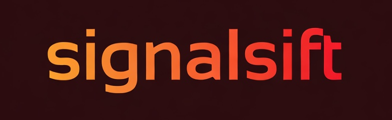

# SignalSift

<p align="center">
  
</p>

**Your personal internet research assistant.** Automatically collects and organizes interesting discussions from Reddit, YouTube, and Hacker News based on topics you care about — then generates tidy markdown reports you can review at your leisure.

> *"Like having a research assistant who reads the internet for you."*

## What It Does

Ever wish you could keep tabs on online discussions without doom-scrolling? SignalSift does the heavy lifting:

- **Pulls content** from subreddits, YouTube channels, and Hacker News
- **Filters by your keywords** so you only see relevant stuff
- **Finds related content** using smart semantic matching (with optional FAISS acceleration)
- **Spots trends** — what's heating up, what's cooling down
- **Creates markdown reports** perfect for reading or feeding to AI
- **Handles failures gracefully** with exponential backoff and retry logic

## Getting Started

```bash
# Install uv if you haven't (https://docs.astral.sh/uv/)
curl -LsSf https://astral.sh/uv/install.sh | sh   # macOS/Linux
# or: powershell -c "irm https://astral.sh/uv/install.ps1 | iex"  # Windows

# Clone and set up
git clone https://github.com/thebiglaskowski/SignalSift.git
cd SignalSift

# Create virtual environment and install dependencies
uv venv
uv pip install -e .

# Grab the language model (for smart matching)
uv run python -m spacy download en_core_web_md

# Optional: Install FAISS for faster semantic search (10-100x speedup)
uv pip install faiss-cpu

# Initialize with example sources
uv run sift init

# Run your first scan
uv run sift scan

# Generate a report
uv run sift report
```

That's it! Check the `reports/` folder for your markdown file.

## Configuration

### Add Your Sources

Edit `config.yaml` or use the CLI:

```bash
# Add a subreddit
sift sources add reddit programming

# Add a YouTube channel
sift sources add youtube UCxyz123

# See what you're tracking
sift sources list
```

### Set Your Keywords

Tell SignalSift what to look for:

```bash
# Add keywords
sift keywords add "machine learning" "python tips" "side project"

# Check your keywords
sift keywords list
```

### Tweak Settings

All the knobs are in `config.yaml`:

```yaml
# How far back to look
reddit:
  max_age_days: 30

# Minimum engagement to bother with
  min_score: 10
  min_comments: 3

# Report preferences
reports:
  max_items_per_section: 15
  excerpt_length: 300
```

## API Keys (Mostly Optional)

| Service | Required? | Notes |
|---------|-----------|-------|
| Reddit | ❌ No | Works out of the box via RSS feeds |
| YouTube | 🟡 Optional | Needed for video/transcript fetching |
| OpenAI | 🟡 Optional | Enables AI-powered summaries |

Copy `.env.example` to `.env` and add any keys you have.

## Commands Cheatsheet

| Command | What it does |
|---------|-------------|
| `sift init` | Set up database with starter sources |
| `sift scan` | Fetch new content from all sources |
| `sift scan --reddit` | Just scan Reddit |
| `sift scan --youtube` | Just scan YouTube |
| `sift scan --hackernews` | Just scan Hacker News |
| `sift report` | Generate a markdown report |
| `sift status` | See database stats |
| `sift sources list` | Show tracked sources |
| `sift keywords list` | Show tracked keywords |
| `sift cache clear` | Clean up old data |
| `sift migrate --check` | Check database migration status |
| `sift migrate` | Run pending database migrations |

## Project Layout

```
SignalSift/
├── pyproject.toml        # Project config & dependencies
├── uv.lock               # Locked dependencies
├── config.yaml           # Your settings
├── .env                  # API keys (git-ignored)
├── data/                 # SQLite database
├── logs/                 # Debug logs
├── reports/              # Generated reports go here
├── src/signalsift/       # The code
│   ├── cli/              # Command-line interface
│   ├── database/         # Models, queries, migrations
│   ├── processing/       # Scoring, semantic matching, classification
│   ├── sources/          # Reddit, YouTube, HackerNews adapters
│   └── utils/            # Retry logic, logging, text utilities
└── tests/                # Test suite (740+ tests)
```

## Tips

- **Start small** — Add a few sources, see what comes back, then expand
- **Check trends** — The report shows what topics are rising/falling
- **Use semantic matching** — SignalSift finds related terms automatically (e.g., "startup" also catches "side project", "bootstrapped")
- **Schedule it** — Run `uv run sift scan && uv run sift report` in a cron job for daily digests

## Development

### Running Tests

```bash
# Install dev dependencies
uv pip install -e ".[dev]"

# Run tests
uv run pytest tests/ -v

# Run with coverage
uv run pytest tests/ -v --cov=src/signalsift --cov-report=term-missing
```

**Test Coverage:** 80% (740+ tests)

### Why uv?

[uv](https://docs.astral.sh/uv/) is a fast Python package installer and resolver written in Rust. It's 10-100x faster than pip and handles virtual environments seamlessly.

### Database Migrations

SignalSift uses a simple migration system to manage schema changes:

```bash
# Check migration status
sift migrate --check

# Apply pending migrations
sift migrate

# Migrate to specific version
sift migrate --version 2
```

Migrations are defined in `src/signalsift/database/migrations.py` and run automatically when the database is initialized.

## FAQ

**Q: Why RSS for Reddit instead of the API?**
A: Reddit's API now requires approval. RSS works instantly with no signup.

**Q: Can I use this for [topic]?**
A: Yes! Just configure your subreddits, channels, and keywords in `config.yaml`.

**Q: Where do reports go?**
A: The `reports/` folder. Each report is dated (e.g., `2025-01-14.md`).

**Q: What's FAISS and do I need it?**
A: FAISS accelerates semantic keyword matching by 10-100x for large vocabularies. It's optional — SignalSift falls back to brute-force matching if FAISS isn't installed.

**Q: How do I update the database schema?**
A: Run `sift migrate` to apply any pending migrations. Use `sift migrate --check` to see the current status.

---

Built for personal use. MIT License.
